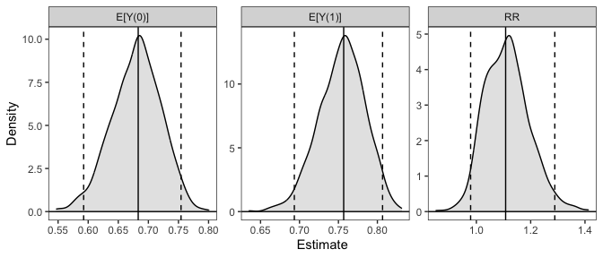

<!-- README.md is generated from README.Rmd. Please edit that file -->

# `clarify`: Simulation-Based Inference for Regression Models

<!-- badges: start -->

[](https://CRAN.R-project.org/package=clarify)
[](https://CRAN.R-project.org/package=clarify)

<!-- badges: end -->

*clarify* implements simulation-based inference for functions of model
parameters, such as average marginal effects and predictions at
representative values of the predictors. See the *clarify*
[website](https://iqss.github.io/clarify/) for documentation and other
examples, and see Greifer et al.
([2025](#ref-greiferClarifySimulationBasedInference2025)) for the paper
describing the package (also available at `vignette("clarify")`).
*clarify* was designed to replicate and expand on functionality
previously provided by the *Zelig* package.

## Installation

*clarify* can be installed from
[CRAN](https://CRAN.R-project.org/package=clarify) using

``` r
install.packages("clarify")
```

You can install the development version of *clarify* from
[GitHub](https://github.com/iqss/clarify) with

``` r
install.packages("remotes")
remotes::install_github("iqss/clarify")
```

## Example

Below is an example of performing g-computation for the average
treatment effect on the treated (ATT) after logistic regression to
compute the average causal risk ratio and its confidence interval. First
we load the data (in this case the `lalonde` dataset from *MatchIt*) and
fit a logistic regression using functions outside of *clarify*:

``` r
library(clarify)

data("lalonde", package = "MatchIt")

# Fit the model
fit <- glm(I(re78 > 0) ~ treat + age + educ + race + married +
             nodegree + re74 + re75,
           data = lalonde, family = binomial)
```

Next, to estimate the ATT risk ratio, we simulate coefficients from
their implied distribution and compute the effects of interest in each
simulation, yielding a distribution of estimates that we can summarize
and use for inference:

``` r
# Simulate coefficients from a multivariate normal distribution
set.seed(123)
sim_coefs <- sim(fit)

# Marginal risk ratio ATT, simulation-based
sim_est <- sim_ame(sim_coefs,
                   var = "treat",
                   subset = treat == 1,
                   contrast = "RR",
                   verbose = FALSE)

sim_est
#> A `clarify_est` object (from `sim_ame()`)
#>  - Average adjusted predictions for `treat`
#>  - 1000 simulated values
#>  - 3 quantities estimated:               
#>  E[Y(0)] 0.6831
#>  E[Y(1)] 0.7568
#>  RR      1.1078

# View the estimates, confidence intervals, and p-values
summary(sim_est, null = c(`RR` = 1))
#>         Estimate 2.5 % 97.5 % P-value
#> E[Y(0)]    0.683 0.592  0.754       .
#> E[Y(1)]    0.757 0.693  0.807       .
#> RR         1.108 0.979  1.289    0.12

# Plot the resulting sampling distributions
plot(sim_est)
```



Below, we provide information on the framework *clarify* uses and some
other examples. For a complete vignette, see `vignette("clarify")`.

## Introduction

Simulation-based inference is an alternative to the delta method and
bootstrapping for performing inference on quantities that are functions
of model parameters. It involves simulating model coefficients from
their multivariate distribution using their estimated values and
covariance from a single model fit to the original data, computing the
quantities of interest from each set of model coefficients, and then
performing inference using the resulting distribution of the estimates
as their sampling distribution. Confidence intervals can be computed
using the percentiles of the resulting sampling distribution, and
p-values can be computed by inverting the confidence intervals.
Alternatively, if the resulting sampling distribution is normally
distributed, its standard error can be estimated as the standard
deviation of the estimates and normal-theory Wald confidence intervals
and p-values can be computed. The methodology of simulation-based
inference is explained in King, Tomz, and Wittenberg
([2000](#ref-kingMakingMostStatistical2000)) and Herron
([1999](#ref-herronPostestimationUncertaintyLimited1999)).

*clarify* was designed to provide a simple, general interface for
simulation-based inference and includes a few convenience functions to
perform common tasks like computing average marginal effects. The
primary functions of *clarify* are `sim()`, `sim_apply()`, `summary()`,
and `plot()`. These work together to create a simple workflow for
simulation-based inference.

- `sim()` simulates model parameters from a fitted model
- `sim_apply()` applies an estimator to the simulated coefficients, or
  to the original object but with the new coefficients inserted
- `summary()` produces confidence intervals and p-values for the
  resulting estimates
- `plot()` produces plots of the simulated sampling distribution of the
  resulting estimates

There are also some wrappers for `sim_apply()` for performing some
common operations: `sim_ame()` computes the average marginal effect of a
variable, mirroring `marginaleffects::avg_predictions()` and
`marginaleffects::avg_slopes()`; `sim_setx()` computes predictions at
typical values of the covariates and differences between them, mirroring
`Zelig::setx()` and `Zelig::setx1()`; and `sim_adrf()` computes average
dose-response functions. *clarify* also offers support for models fit to
multiply imputed data with the `misim()` function.

In the example above, we used `sim_ame()` to compute the ATT, but we
could have also done so manually using `sim_apply()`, as demonstrated
below:

``` r
# Write a function that computes the g-computation estimate for the ATT
ATT_fun <- function(fit) {
  d <- subset(lalonde, treat == 1)
  d$treat <- 1
  p1 <- mean(predict(fit, newdata = d, type = "response"))
  d$treat <- 0
  p0 <- mean(predict(fit, newdata = d, type = "response"))
  c(`E[Y(0)]` = p0, `E[Y(1)]` = p1, `RR` = p1 / p0)
}

# Apply that function to the simulated coefficient
sim_est <- sim_apply(sim_coefs, ATT_fun, verbose = FALSE)

sim_est
#> A `clarify_est` object (from `sim_apply()`)
#>  - 1000 simulated values
#>  - 3 quantities estimated:               
#>  E[Y(0)] 0.6831
#>  E[Y(1)] 0.7568
#>  RR      1.1078

# View the estimates, confidence intervals, and p-values;
# they are the same as when using sim_ame() above
summary(sim_est, null = c(`RR` = 1))
#>         Estimate 2.5 % 97.5 % P-value
#> E[Y(0)]    0.683 0.592  0.754       .
#> E[Y(1)]    0.757 0.693  0.807       .
#> RR         1.108 0.979  1.289    0.12

# Plot the resulting sampling distributions
plot(sim_est, reference = TRUE, ci = FALSE)
```


The plot of the simulated sampling distribution indicates that the
sampling distribution for the risk ratio is not normally distributed
around the estimate, indicating that the delta method may be a poor
approximation and the asymmetric confidence intervals produced using the
simulation may be more valid. Note that the estimates are those computed
from the original model coefficients; the distribution is used only for
computing confidence intervals, in line with recommendations by Rainey
([2023](#ref-raineyCarefulConsiderationCLARIFY2023)).

If we want to compute the risk difference, we can do that using
`transform()` on the already-produced output:

``` r
#Transform estimates into new quantities of interest
sim_est <- transform(sim_est, `RD` = `E[Y(1)]` - `E[Y(0)]`)

summary(sim_est, null = c(`RR` = 1, `RD` = 0))
#>         Estimate   2.5 %  97.5 % P-value
#> E[Y(0)]   0.6831  0.5925  0.7543       .
#> E[Y(1)]   0.7568  0.6934  0.8067       .
#> RR        1.1078  0.9789  1.2888    0.12
#> RD        0.0737 -0.0155  0.1742    0.12
```

We can also use *clarify* to compute predictions and first differences
at set and typical values of the predictors, mimicking the functionality
of *Zelig*’s `setx()` and `setx1()` functions, using `sim_setx()`:

``` r
# Predictions across age and treat at typical values
# of the other predictors
sim_est <- sim_setx(sim_coefs,
                    x = list(age = 20:50, treat = 0:1),
                    verbose = FALSE)

#Plot of predicted values across age for each value of treat
plot(sim_est)
```


See `vignette("Zelig", package = "clarify")` for more examples of
translating a *Zelig*-based workflow into one that uses *clarify* to
estimate the same quantities of interest.

*clarify* offers parallel processing for all estimation functions to
speed up computation. Functionality is also available for the analysis
of models fit to multiply imputed data. See `vignette("clarify")` for
more details.

## References

<div id="refs" class="references csl-bib-body hanging-indent"
entry-spacing="0">

<div id="ref-greiferClarifySimulationBasedInference2025"
class="csl-entry">

Greifer, Noah, Steven Worthington, Stefano Iacus, and Gary King. 2025.
“Clarify: Simulation-Based Inference for Regression Models.” *The R
Journal* 16 (2): 154–74. <https://doi.org/10.32614/RJ-2024-015>.

</div>

<div id="ref-herronPostestimationUncertaintyLimited1999"
class="csl-entry">

Herron, Michael C. 1999. “Postestimation Uncertainty in Limited
Dependent Variable Models.” *Political Analysis* 8 (1): 83–98.
<https://doi.org/10.1093/oxfordjournals.pan.a029806>.

</div>

<div id="ref-kingMakingMostStatistical2000" class="csl-entry">

King, Gary, Michael Tomz, and Jason Wittenberg. 2000. “Making the Most
of Statistical Analyses: Improving Interpretation and Presentation.”
*American Journal of Political Science* 44 (2): 347–61.
<https://doi.org/10.2307/2669316>.

</div>

<div id="ref-raineyCarefulConsiderationCLARIFY2023" class="csl-entry">

Rainey, Carlisle. 2023. “A Careful Consideration of CLARIFY:
Simulation-Induced Bias in Point Estimates of Quantities of Interest.”
*Political Science Research and Methods*, 1–10.
<https://doi.org/10.1017/psrm.2023.8>.

</div>

</div>
